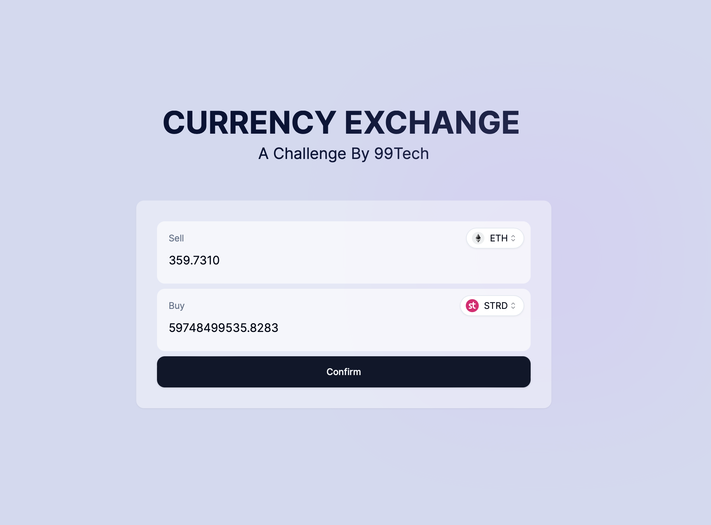

# 99Tech Code Challenge #1 #

## Problem1
The solution for Problem 1 can be found in the main.js file. Please review this file for the complete implementation.

## Problem2
To run the Next.js application located inside the currency-exchange directory, follow these steps:

* Install the dependencies:

```sh
pnpm install
```

* Start the development server:
```
pnpm run dev
```


## Problem3
Please refer to the `readme.md` file inside. 